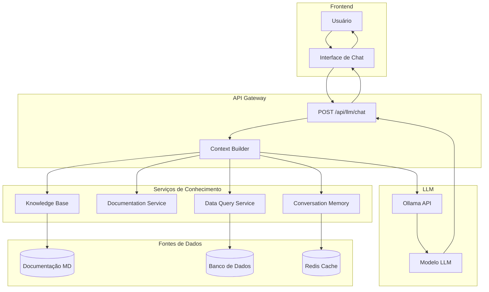
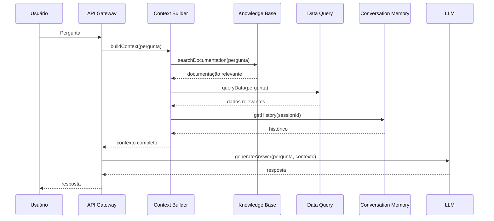

# Arquitetura do Assistente LLM Flexível - Sistema de Controle de Estoque

**Data:** 15/02/2026  
**Versão:** 1.0  
**Status:** Proposta de Arquitetura

---

## 1. Resumo Executivo

Este documento propõe uma nova arquitetura para o assistente LLM do Sistema de Controle de Estoque que permita responder **qualquer pergunta relacionada ao sistema**, não apenas perguntas específicas predefinidas.

### Problema Atual

O sistema atual possui as seguintes limitações críticas:

1. **Arquitetura baseada em padrões de detecção (regex)** - Apenas 18 padrões predefinidos
2. **Prompt excessivamente restritivo** - Instruções como "NUNCA use conhecimento externo" e "Responda APENAS usando os dados de estoque fornecidos"
3. **Modelo LLM muito pequeno** - qwen3:1.7b (1.7 bilhões de parâmetros) incapaz de processar instruções complexas
4. **Contexto limitado** - Apenas dados brutos de produtos, sem explicações sobre o sistema
5. **Sem capacidade de responder perguntas conceituais** - Não pode explicar como o sistema funciona, conceitos do domínio, etc.

### Objetivo da Nova Arquitetura

Projetar uma arquitetura que permita o LLM:

1. Aprender sobre o sistema (documentação, conceitos, fluxos)
2. Responder qualquer pergunta relacionada ao sistema
3. Usar conhecimento externo quando apropriado para explicar conceitos
4. Processar perguntas complexas que exigem filtragem e agregação
5. Responder perguntas conceituais sobre como o sistema funciona

---

## 2. Arquitetura Proposta

### 2.1 Visão Geral

A nova arquitetura baseia-se em **RAG (Retrieval-Augmented Generation)** com um sistema de conhecimento estruturado que inclui:

- Documentação do sistema
- Conceitos do domínio
- Fluxos de trabalho
- Dados em tempo real do banco de dados
- Histórico de conversas

### 2.2 Diagrama de Arquitetura



### 2.3 Componentes Principais

#### 2.3.1 Context Builder (Novo)

Responsável por construir o contexto completo para o LLM, combinando:

- Documentação do sistema
- Dados relevantes do banco de dados
- Histórico da conversa
- Metadados do usuário

**Arquivo:** `src/services/context-builder.service.ts`

#### 2.3.2 Knowledge Base (Novo)

Armazena e indexa toda a documentação do sistema para busca rápida.

**Arquivo:** `src/services/knowledge-base.service.ts`

**Fontes de conhecimento:**
- `docs/arquitetura.md` - Arquitetura do sistema
- `docs/database.md` - Modelo de dados
- `docs/api.md` - Documentação da API
- `docs/llm-prompts.md` - Prompts existentes
- Novo: `docs/conceitos.md` - Conceitos do domínio (a criar)
- Novo: `docs/fluxos.md` - Fluxos de trabalho (a criar)

#### 2.3.3 Documentation Service (Novo)

Gerencia o acesso e formatação da documentação do sistema.

**Arquivo:** `src/services/documentation.service.ts`

#### 2.3.4 Data Query Service (Melhorado)

Expande as capacidades de busca de dados para suportar consultas mais complexas.

**Arquivo:** `src/services/data-query.service.ts` (renomeado de `produto-search.service.ts`)

#### 2.3.5 Conversation Memory (Novo)

Gerencia o histórico de conversas para permitir follow-ups e perguntas relacionadas.

**Arquivo:** `src/services/conversation-memory.service.ts`

---

## 3. Estrutura de Prompts Flexível

### 3.1 System Prompt

O novo system prompt será mais flexível e educativo:

```typescript
const SYSTEM_PROMPT = `Você é um assistente especialista no Sistema de Controle de Estoque para Licitações Públicas.

## Seu Conhecimento

Você tem acesso a:
1. Documentação completa do sistema (arquitetura, API, banco de dados)
2. Dados em tempo real do banco de dados (produtos, pedidos, aquisições, etc.)
3. Conceitos do domínio de licitações públicas
4. Fluxos de trabalho do sistema
5. Histórico da conversa atual

## Como Responder

### Perguntas sobre Dados
- Use os dados fornecidos no contexto
- Seja preciso com números e valores
- Cite as fontes dos dados quando relevante

### Perguntas Conceituais
- Explique os conceitos do domínio
- Use analogias quando apropriado
- Relacione com o contexto do sistema
- Use conhecimento externo para enriquecer explicações

### Perguntas sobre Funcionamento do Sistema
- Explique como os componentes interagem
- Descreva os fluxos de trabalho
- Mostre exemplos práticos
- Referencie a documentação do sistema

### Quando Não Souber
- Admita claramente que não sabe
- Sugira onde encontrar a informação
- Ofereça alternativas se possível

## Formato de Resposta

Responda em formato JSON:
{
  "resposta": "sua resposta detalhada",
  "tipo": "DADO" | "CONCEITO" | "FLUXO" | "RECOMENDACAO",
  "fontes": ["lista de fontes utilizadas"],
  "acoes_sugeridas": ["ações relevantes"] ou null
}`
```

### 3.2 User Prompt

O user prompt será construído dinamicamente pelo Context Builder:

```typescript
const buildUserPrompt = (pergunta: string, contexto: ContextoLLM) => {
  return `
## Pergunta do Usuário
${pergunta}

${contexto.documentacao ? `
## Documentação do Sistema
${contexto.documentacao}
` : ''}

${contexto.dados ? `
## Dados Disponíveis
${contexto.dados}
` : ''}

${contexto.conceitos ? `
## Conceitos Relevantes
${contexto.conceitos}
` : ''}

${contexto.historico ? `
## Histórico da Conversa
${contexto.historico}
` : ''}

---
Responda à pergunta usando as informações fornecidas acima.
`
}
```

---

## 4. Estratégia de RAG (Retrieval-Augmented Generation)

### 4.1 Fluxo de Busca de Contexto



### 4.2 Algoritmo de Busca de Documentação

```typescript
async function searchDocumentation(pergunta: string): Promise<string> {
  // 1. Extrair palavras-chave da pergunta
  const keywords = extractKeywords(pergunta)
  
  // 2. Buscar em diferentes fontes
  const results = await Promise.all([
    searchInFile('docs/arquitetura.md', keywords),
    searchInFile('docs/database.md', keywords),
    searchInFile('docs/api.md', keywords),
    searchInFile('docs/conceitos.md', keywords),
    searchInFile('docs/fluxos.md', keywords)
  ])
  
  // 3. Ranquear por relevância
  const ranked = rankResults(results, keywords)
  
  // 4. Retornar os top N resultados
  return formatDocumentation(ranked.slice(0, 3))
}
```

### 4.3 Algoritmo de Busca de Dados

```typescript
async function queryData(pergunta: string): Promise<string> {
  // 1. Analisar tipo de pergunta
  const tipo = analyzeQuestionType(pergunta)
  
  switch (tipo) {
    case 'PRODUTO_ESPECIFICO':
      return await buscarProdutoPorNome(pergunta)
    case 'ESTOQUE_GERAL':
      return await buscarContextoEstoque(100)
    case 'ESTOQUE_CRITICO':
      return await buscarContextoEstoqueCritico()
    case 'PEDIDOS':
      return await buscarContextoPedidos(pergunta)
    case 'AQUISICOES':
      return await buscarContextoAquisicoes(pergunta)
    case 'RELATORIO':
      return await gerarRelatorioDados(pergunta)
    default:
      return await buscarContextoEstoque(50)
  }
}
```

---

## 5. Modelo LLM Recomendado

### 5.1 Avaliação de Modelos

| Modelo | Parâmetros | Context Window | Vantagens | Desvantagens | Recomendação |
|--------|------------|----------------|------------|--------------|--------------|
| qwen3:1.7b | 1.7B | 8K | Leve, rápido | Incapaz de processar instruções complexas | ❌ Não usar |
| llama3:8b | 8B | 8K | Bom equilíbrio, boa capacidade de raciocínio | Requer mais memória | ✅ **Recomendado** |
| mistral:7b | 7B | 8K | Excelente performance, bom para instruções | Requer mais memória | ✅ Alternativa boa |
| qwen2.5:7b | 7B | 32K | Grande contexto window, bom para português | Requer mais memória | ✅ Alternativa boa |

### 5.2 Recomendação: llama3:8b

**Justificativa:**

1. **Capacidade de raciocínio superior** - 8B parâmetros permitem processar instruções complexas
2. **Bom suporte a português** - Treinado em diversos idiomas
3. **Context window adequado** - 8K tokens suficiente para a maioria dos casos
4. **Performance aceitável** - Roda bem em CPU moderna
5. **Comunidade ativa** - Muitos recursos e suporte disponível

**Configuração recomendada:**

```typescript
const LLM_CONFIG = {
  model: 'llama3:8b',
  temperature: 0.4,  // Balanceamento entre criatividade e precisão
  max_tokens: 3000,  // Suficiente para respostas detalhadas
  stream: false,
  options: {
    num_ctx: 8192,  // Context window completo
    top_p: 0.9,
    top_k: 40
  }
}
```

### 5.3 Requisitos de Hardware

| Modelo | RAM Mínima | RAM Recomendada | CPU | GPU (opcional) |
|--------|-------------|-----------------|-----|----------------|
| qwen3:1.7b | 2GB | 4GB | 2+ cores | Não necessária |
| llama3:8b | 6GB | 8GB | 4+ cores | Não necessária (recomendada para velocidade) |
| mistral:7b | 5GB | 8GB | 4+ cores | Não necessária (recomendada para velocidade) |
| qwen2.5:7b | 6GB | 8GB | 4+ cores | Não necessária (recomendada para velocidade) |

---

## 6. Tipos de Perguntas Suportadas

### 6.1 Perguntas sobre Dados

**Exemplos:**
- "Qual o saldo atual de canetas azuis?"
- "Quais produtos estão com estoque crítico?"
- "Quantos pedidos foram feitos em janeiro?"
- "Qual o valor total da aquisição LIC-2024-0001?"

**Tratamento:**
- Buscar dados relevantes no banco de dados
- Formatar dados para o contexto
- LLM processa e responde com precisão

### 6.2 Perguntas Conceituais

**Exemplos:**
- "O que é uma aquisição por pregão?"
- "Como funciona o processo de licitação pública?"
- "Qual a diferença entre aditivo e contrato principal?"
- "O que significa saldo crítico?"

**Tratamento:**
- Buscar documentação relevante
- Usar conhecimento externo para enriquecer
- Explicar com exemplos do sistema

### 6.3 Perguntas sobre Funcionamento do Sistema

**Exemplos:**
- "Como funciona o fluxo de criação de pedidos?"
- "Qual a relação entre aquisições e produtos?"
- "Como o sistema calcula o saldo crítico?"
- "Onde são armazenadas as movimentações de estoque?"

**Tratamento:**
- Buscar documentação de arquitetura
- Buscar documentação de banco de dados
- Explicar fluxos e relacionamentos

### 6.4 Perguntas Complexas com Agregação

**Exemplos:**
- "Qual o consumo médio de papelaria por secretaria nos últimos 6 meses?"
- "Quais fornecedores tiveram mais atrasos de entrega?"
- "Qual a tendência de consumo de produtos de limpeza?"

**Tratamento:**
- Executar queries complexas no banco de dados
- Agregar dados
- LLM analisa e apresenta insights

### 6.5 Perguntas com Follow-up

**Exemplos:**
- "Quais produtos estão críticos?" → "E quais são os fornecedores desses produtos?"
- "Qual o saldo de canetas?" → "E de lápis?"

**Tratamento:**
- Usar Conversation Memory
- Manter contexto da conversa
- Permitir referências a perguntas anteriores

---

## 7. Estrutura de Arquivos Proposta

```
src/
├── services/
│   ├── llm.service.ts                    # Serviço LLM existente (modificado)
│   ├── context-builder.service.ts          # NOVO: Constrói contexto completo
│   ├── knowledge-base.service.ts          # NOVO: Gerencia base de conhecimento
│   ├── documentation.service.ts           # NOVO: Acesso à documentação
│   ├── data-query.service.ts              # RENOMEADO: De produto-search.service.ts
│   ├── conversation-memory.service.ts     # NOVO: Gerencia histórico de conversas
│   ├── estoque-context.service.ts         # Existente (mantido)
│   └── pedidos-context.service.ts        # Existente (mantido)
│
├── app/
│   └── api/
│       └── llm/
│           └── chat/
│               └── route.ts               # MODIFICADO: Nova lógica de chat
│
└── lib/
    ├── llm/
    │   ├── prompts.ts                    # NOVO: Centraliza todos os prompts
    │   └── types.ts                      # NOVO: Tipos TypeScript para LLM
    └── rag/
        ├── retriever.ts                   # NOVO: Lógica de recuperação
        ├── ranker.ts                      # NOVO: Lógica de ranqueamento
        └── vector-store.ts                # NOVO: Armazenamento de vetores (opcional)

docs/
├── arquitetura.md                         # Existente
├── database.md                            # Existente
├── api.md                                 # Existente
├── llm-prompts.md                         # Existente
├── conceitos.md                           # NOVO: Conceitos do domínio
├── fluxos.md                              # NOVO: Fluxos de trabalho
└── llm-assistente-flexivel.md             # Este documento
```

---

## 8. Implementação por Etapas

### Etapa 1: Preparação da Base de Conhecimento

**Objetivo:** Criar e organizar a documentação necessária.

**Tarefas:**
1. Criar `docs/conceitos.md` com conceitos do domínio:
   - Licitações públicas
   - Modalidades de licitação
   - Aquisições e contratos
   - Gestão de estoque
   - Pedidos e fornecedores

2. Criar `docs/fluxos.md` com fluxos de trabalho:
   - Fluxo de criação de pedidos
   - Fluxo de entrada de estoque
   - Fluxo de saída de estoque
   - Fluxo de gestão de aquisições

3. Indexar documentação existente para busca rápida

### Etapa 2: Implementação do Context Builder

**Objetivo:** Criar o serviço que constrói o contexto completo.

**Tarefas:**
1. Criar `src/services/context-builder.service.ts`
2. Implementar lógica de análise de perguntas
3. Implementar busca de documentação relevante
4. Implementar busca de dados relevantes
5. Implementar integração com Conversation Memory

### Etapa 3: Implementação dos Serviços de Conhecimento

**Objetivo:** Criar serviços para gerenciar o conhecimento do sistema.

**Tarefas:**
1. Criar `src/services/knowledge-base.service.ts`
2. Criar `src/services/documentation.service.ts`
3. Criar `src/services/conversation-memory.service.ts`
4. Implementar cache em Redis para performance

### Etapa 4: Melhoria do Serviço de Busca de Dados

**Objetivo:** Expandir as capacidades de busca de dados.

**Tarefas:**
1. Renomear `produto-search.service.ts` para `data-query.service.ts`
2. Adicionar funções para buscar pedidos, aquisições, etc.
3. Implementar análise de tipo de pergunta
4. Implementar queries complexas com agregação

### Etapa 5: Atualização da API de Chat

**Objetivo:** Modificar o endpoint `/api/llm/chat` para usar a nova arquitetura.

**Tarefas:**
1. Remover lógica de detecção por padrões regex
2. Integrar Context Builder
3. Atualizar prompts para serem mais flexíveis
4. Implementar gerenciamento de sessões

### Etapa 6: Troca do Modelo LLM

**Objetivo:** Atualizar para um modelo mais capaz.

**Tarefas:**
1. Baixar e instalar llama3:8b via Ollama
2. Atualizar configuração em `src/services/llm.service.ts`
3. Testar com diferentes tipos de perguntas
4. Ajustar parâmetros (temperature, max_tokens, etc.)

### Etapa 7: Testes e Validação

**Objetivo:** Validar que a nova arquitetura atende aos requisitos.

**Tarefas:**
1. Criar suite de testes para diferentes tipos de perguntas
2. Testar perguntas sobre dados
3. Testar perguntas conceituais
4. Testar perguntas sobre funcionamento do sistema
5. Testar perguntas complexas com agregação
6. Testar follow-ups e perguntas relacionadas
7. Validar performance e tempo de resposta

### Etapa 8: Monitoramento e Otimização

**Objetivo:** Garantir performance e qualidade contínuas.

**Tarefas:**
1. Implementar logging detalhado
2. Monitorar tempo de resposta
3. Monitorar qualidade das respostas
4. Implementar feedback do usuário
5. Otimizar queries e cache
6. Ajustar prompts com base em feedback

---

## 9. Exemplos de Interação

### Exemplo 1: Pergunta Conceitual

**Usuário:** "O que é uma aquisição por pregão?"

**Contexto construído:**
- Documentação sobre modalidades de licitação
- Definição de pregão em `docs/conceitos.md`
- Exemplos de pregões no banco de dados

**Resposta do LLM:**
```json
{
  "resposta": "O pregão é uma modalidade de licitação pública regulamentada pela Lei 14.133/21, caracterizada pela disputa pelo menor preço. É amplamente utilizado para aquisição de bens comuns e serviços gerais. No sistema, as aquisições por pregão são registradas com a modalidade 'PREGAO' e incluem informações como número do processo, fornecedor, data de início e fim do contrato, e lista de produtos contratados. Por exemplo, a aquisição LIC-2024-0001 é um pregão com 15 produtos contratados.",
  "tipo": "CONCEITO",
  "fontes": ["docs/conceitos.md", "docs/api.md", "banco de dados"],
  "acoes_sugeridas": null
}
```

### Exemplo 2: Pergunta sobre Funcionamento

**Usuário:** "Como funciona o fluxo de criação de pedidos?"

**Contexto construído:**
- Documentação de arquitetura
- Fluxo de criação de pedidos em `docs/fluxos.md`
- Exemplos de pedidos no banco de dados

**Resposta do LLM:**
```json
{
  "resposta": "O fluxo de criação de pedidos no sistema segue estes passos:\n\n1. **Seleção de Secretaria e Setor**: O usuário escolhe a secretaria e setor de destino\n2. **Adição de Itens**: Produtos são adicionados ao pedido com quantidades\n3. **Verificação de Disponibilidade**: O sistema verifica se há saldo suficiente\n4. **Aprovação**: O pedido é aprovado por um usuário com permissão\n5. **Finalização**: O pedido é finalizado e um PDF é gerado\n\nDurante todo o processo, o sistema valida:\n- Se o saldo atual é suficiente para atender o pedido\n- Se os produtos estão ativos\n- Se o usuário tem permissão para criar pedidos\n\nApós a finalização, os itens são marcados como indisponíveis e o saldo de estoque é atualizado.",
  "tipo": "FLUXO",
  "fontes": ["docs/arquitetura.md", "docs/fluxos.md", "docs/database.md"],
  "acoes_sugeridas": null
}
```

### Exemplo 3: Pergunta com Follow-up

**Usuário:** "Quais produtos estão com estoque crítico?"

**Contexto construído:**
- Dados de produtos com saldo crítico
- Definição de saldo crítico

**Resposta do LLM:**
```json
{
  "resposta": "Identifiquei 5 produtos com estoque crítico (saldo atual <= saldo mínimo):\n\n1. **Lápis HB** (PAQ-41): Saldo atual 30, mínimo 50\n2. **Borracha branca** (PAQ-12): Saldo atual 10, mínimo 100\n3. **Caderno capa dura** (PAQ-33): Saldo atual 5, mínimo 50\n4. **Caneta preta** (PAQ-08): Saldo atual 25, mínimo 100\n5. **Papel A4** (PAQ-45): Saldo atual 45, mínimo 200\n\nO valor total estimado para reposição é de R$ 1.250,00.",
  "tipo": "DADO",
  "fontes": ["banco de dados"],
  "acoes_sugeridas": [
    "Gerar pedido de reposição urgente",
    "Verificar prazos de entrega dos fornecedores"
  ]
}
```

**Usuário:** "E quais são os fornecedores desses produtos?"

**Contexto construído:**
- Histórico da conversa (pergunta anterior)
- Dados de fornecedores dos produtos críticos

**Resposta do LLM:**
```json
{
  "resposta": "Os fornecedores dos produtos com estoque crítico são:\n\n1. **Lápis HB, Borracha branca, Caderno capa dura**: Papelaria Central Ltda (FOR-2024-0001)\n2. **Caneta preta, Papel A4**: Material Escolar SA (FOR-2024-0002)\n\nA Papelaria Central tem histórico de 98% de entregas no prazo, enquanto a Material Escolar tem 92%. Recomenda-se priorizar o pedido com a Papelaria Central devido ao melhor histórico.",
  "tipo": "DADO",
  "fontes": ["banco de dados", "histórico de conversa"],
  "acoes_sugeridas": [
    "Criar pedido separado por fornecedor",
    "Considerar histórico de entregas ao planejar"
  ]
}
```

---

## 10. Considerações de Performance

### 10.1 Estratégias de Otimização

1. **Cache de Documentação**
   - Cache em Redis com TTL de 1 hora
   - Invalidação manual quando documentação é atualizada

2. **Cache de Consultas de Dados**
   - Cache de resultados de queries frequentes
   - TTL de 5 minutos para dados dinâmicos

3. **Pré-carregamento de Contexto**
   - Carregar documentação mais acessada na inicialização
   - Manter em memória para acesso rápido

4. **Busca Incremental**
   - Buscar apenas documentação relevante para a pergunta
   - Usar TF-IDF ou embeddings para ranqueamento

5. **Streaming de Respostas**
   - Implementar streaming para respostas longas
   - Melhora experiência do usuário

### 10.2 Métricas de Performance

| Métrica | Alvo | Como Medir |
|---------|-------|------------|
| Tempo de construção de contexto | < 500ms | Logging no Context Builder |
| Tempo de resposta do LLM | < 5s | Logging na API |
| Tempo total da requisição | < 6s | Logging na API |
| Taxa de cache hit | > 70% | Métricas do Redis |
| Qualidade das respostas | > 80% satisfação | Feedback do usuário |

---

## 11. Considerações de Segurança

### 11.1 Proteção de Dados

1. **Sanitização de Inputs**
   - Validar todas as entradas do usuário
   - Remover código malicioso

2. **Controle de Acesso**
   - Verificar permissões do usuário
   - Filtrar dados sensíveis

3. **Auditoria**
   - Log de todas as perguntas e respostas
   - Rastreabilidade completa

### 11.2 Prevenção de Ataques

1. **Prompt Injection**
   - Sanitizar prompts do usuário
   - Limitar tamanho do prompt

2. **Data Exfiltration**
   - Limitar quantidade de dados retornados
   - Filtrar informações sensíveis

3. **Resource Exhaustion**
   - Rate limiting por usuário
   - Timeout em queries de banco de dados

---

## 12. Plano de Migração

### Fase 1: Preparação (Semana 1-2)

- [ ] Criar documentação de conceitos
- [ ] Criar documentação de fluxos
- [ ] Instalar modelo llama3:8b
- [ ] Configurar Redis para cache

### Fase 2: Implementação (Semana 3-5)

- [ ] Implementar Context Builder
- [ ] Implementar Knowledge Base
- [ ] Implementar Documentation Service
- [ ] Implementar Conversation Memory
- [ ] Melhorar Data Query Service

### Fase 3: Integração (Semana 6)

- [ ] Atualizar API de chat
- [ ] Remover lógica de detecção por padrões
- [ ] Atualizar prompts
- [ ] Implementar gerenciamento de sessões

### Fase 4: Testes (Semana 7)

- [ ] Criar suite de testes
- [ ] Testar todos os tipos de perguntas
- [ ] Validar performance
- [ ] Corrigir bugs

### Fase 5: Deploy (Semana 8)

- [ ] Deploy em ambiente de staging
- [ ] Testes de aceitação
- [ ] Deploy em produção
- [ ] Monitoramento inicial

---

## 13. Riscos e Mitigações

| Risco | Impacto | Probabilidade | Mitigação |
|-------|---------|---------------|------------|
| Modelo LLM não roda no hardware atual | Alto | Médio | Testar antes de implementar; considerar modelo menor se necessário |
| Performance insuficiente com contexto grande | Alto | Médio | Implementar cache; otimizar queries; usar streaming |
| Qualidade das respostas abaixo do esperado | Médio | Alta | Coletar feedback; ajustar prompts iterativamente |
| Complexidade de manutenção | Médio | Média | Documentar extensivamente; criar testes abrangentes |
| Custo de infraestrutura | Baixo | Baixa | Usar hardware existente; otimizar recursos |

---

## 14. Conclusão

A nova arquitetura proposta para o assistente LLM flexível representa uma evolução significativa em relação ao sistema atual. Ao implementar RAG com uma base de conhecimento estruturada e um modelo LLM mais capaz, o sistema será capaz de:

1. **Responder qualquer pergunta relacionada ao sistema** - Não limitado a padrões predefinidos
2. **Explicar conceitos do domínio** - Usando documentação e conhecimento externo
3. **Descrever funcionamento do sistema** - Com base na arquitetura e fluxos documentados
4. **Processar perguntas complexas** - Com agregação e análise de dados
5. **Manter contexto de conversa** - Permitindo follow-ups e perguntas relacionadas

A implementação proposta é escalável, mantível e preparada para evoluções futuras, como a adição de novas fontes de conhecimento ou a integração com outros sistemas.

---

## 15. Referências

1. Lei 8.666/93 - Licitações Públicas
2. Lei 14.133/21 - Novo Marco das Licitações
3. LGPD - Lei 13.709/18
4. Next.js 15 Documentation
5. Prisma ORM Documentation
6. Ollama - Running LLM Locally
7. Retrieval-Augmented Generation (RAG) - Lewis et al., 2020
8. llama3:8b Model Card
9. Redis Documentation
10. TypeScript Best Practices

---

**Fim do Documento**
