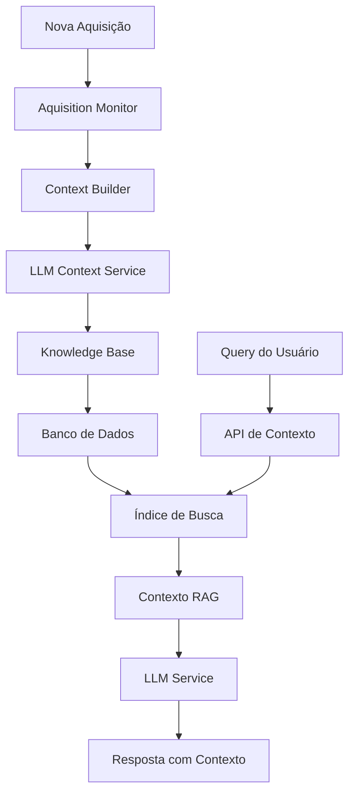

# Sistema RAG para Aquisições - Documentação

**Data:** 08/03/2026  
**Versão:** 1.0  
**Status:** Implementado

## Resumo

Este documento descreve o sistema de RAG (Retrieval-Augmented Generation) implementado para gerar contextos enriquecidos de aquisições automaticamente, permitindo que o assistente IA responda perguntas com informações precisas sobre produtos e contratos.

## Arquitetura

### Componentes

1. **LLM Context Service** ([`src/services/llm-context.service.ts`](src/services/llm-context.service.ts))
   - Conecta ao Ollama (Qwen2.5-3B)
   - Gera descrições enriquecidas de produtos
   - Extrai palavras-chave e tags
   - Implementa busca por similaridade

2. **Context Builder para Aquisições** ([`src/services/context-builder-aquisicoes.service.ts`](src/services/context-builder-aquisicoes.service.ts))
   - Processa aquisições e extrai produtos
   - Usa o LLM para enriquecer descrições
   - Cria estrutura JSON padronizada para RAG
   - Gera palavras-chave e tags para busca

3. **Knowledge Base** ([`src/services/knowledge-base.service.ts`](src/services/knowledge-base.service.ts))
   - Salva contextos gerados no banco de dados
   - Mantém índices de busca em memória
   - Implementa busca por palavras-chave
   - Recupera contexto relevante para queries

4. **Aquisition Monitor** ([`src/services/aquisition-monitor.service.ts`](src/services/aquisition-monitor.service.ts))
   - Verifica periodicamente novas aquisições
   - Dispara geração de contexto para aquisições não processadas
   - Roda em background

5. **API de Contexto** ([`src/app/api/contexto/route.ts`](src/app/api/contexto/route.ts))
   - Endpoint para gerar contexto manualmente
   - Endpoint para buscar contexto por query
   - Endpoint para obter contexto de uma aquisição
   - Endpoint para reprocessar contexto

6. **Integração com LLM** ([`src/services/llm.service.ts`](src/services/llm.service.ts))
   - Método `perguntarComRAG()` para gerar respostas com contexto RAG
   - Busca contexto relevante automaticamente
   - Inclui contexto na resposta do LLM

### Fluxo de Dados



## Configuração

### Modelo LLM

O sistema usa o modelo **Qwen2.5-3B** via Ollama:

```typescript
const LLM_CONFIG = {
  model: "qwen2.5:3b",
  temperature: 0.3,
  max_tokens: 2000,
  stream: false,
  options: {
    num_ctx: 4096,
    top_p: 0.9,
    top_k: 40
  }
}
```

### Monitor de Aquisições

Configuração padrão:

```typescript
{
  intervaloVerificacao: 5 * 60 * 1000, // 5 minutos
  maxProcessamentosPorCiclo: 5,
  habilitado: true
}
```

## Uso

### 1. Gerar Contexto Manualmente

**Endpoint:** `POST /api/contexto`

**Body:**
```json
{
  "aquisicao_id": 1,
  "acao": "gerar"
}
```

**Resposta:**
```json
{
  "success": true,
  "data": {
    "sucesso": true,
    "aquisicao_id": 1,
    "tempo_processamento": 5000
  }
}
```

### 2. Buscar Contexto por Query

**Endpoint:** `GET /api/contexto/buscar`

**Parâmetros:**
- `query`: Query de busca (obrigatório)
- `limite`: Número máximo de resultados (opcional, padrão: 5)

**Exemplo:**
```
GET /api/contexto/buscar?query=caneta%20azul&limite=3
```

**Resposta:**
```json
{
  "success": true,
  "data": {
    "query": "caneta azul",
    "resultados": [
      {
        "contexto": {
          "aquisicao": { ... },
          "produtos": [ ... ],
          "metadados": { ... }
        },
        "score": 0.85,
        "produtos_relevantes": [ ... ]
      }
    ],
    "total": 1,
    "tempo_busca_ms": 150
  }
}
```

### 3. Obter Contexto de uma Aquisição

**Endpoint:** `GET /api/contexto/[id]`

**Exemplo:**
```
GET /api/contexto/1
```

**Resposta:**
```json
{
  "success": true,
  "data": {
    "aquisicao": { ... },
    "produtos": [ ... ],
    "metadados": { ... }
  }
}
```

### 4. Reprocessar Contexto

**Endpoint:** `POST /api/contexto/[id]/reprocessar`

**Exemplo:**
```
POST /api/contexto/1/reprocessar
```

**Resposta:**
```json
{
  "success": true,
  "data": {
    "aquisicao_id": 1,
    "tempo_processamento": 5000,
    "contexto": { ... }
  }
}
```

### 5. Usar LLM com Contexto RAG

**Endpoint:** `POST /api/llm/chat`

**Body:**
```json
{
  "pergunta": "Quais canetas estão disponíveis?"
}
```

**Resposta:**
```json
{
  "success": true,
  "data": {
    "resposta": "Encontrei 3 tipos de canetas disponíveis: ...",
    "contexto_utilizado": {
      "tipo_resposta": "DADO",
      "dados_utilizados": ["contexto_rag", "banco_de_dados"]
    },
    "contexto_rag": {
      "encontrados": 2,
      "tempo_busca_ms": 150,
      "aquisicoes": [
        { "id": 1, "numero": "LIC-2024-0001", "score": 0.85 },
        { "id": 2, "numero": "LIC-2024-0002", "score": 0.72 }
      ]
    }
  }
}
```

## Estrutura do Contexto RAG

O contexto gerado segue esta estrutura JSON:

```json
{
  "aquisicao": {
    "id": 1,
    "numero": "LIC-2024-0001",
    "modalidade": "PREGAO",
    "fornecedor": "Papelaria Central Ltda",
    "fornecedor_id": 1,
    "data_inicio": "2024-01-15T00:00:00.000Z",
    "data_fim": "2024-12-31T00:00:00.000Z",
    "numero_contrato": "123/2024"
  },
  "produtos": [
    {
      "codigo": "PAQ-1-1",
      "descricao": "Caneta esferográfica azul",
      "descricao_enriquecida": "Caneta esferográfica de cor azul, ponta fina, ideal para escrita diária em escritório e escolas.",
      "palavras_chave": ["caneta", "esferográfica", "azul", "escrita"],
      "categoria": "Papelaria",
      "unidade": "UN",
      "preco_unitario": 1.50,
      "quantidade_contratada": 1000,
      "aplicacoes": ["escrita", "documentação", "escolar"],
      "tags": ["material escritório", "consumíveis"]
    }
  ],
  "metadados": {
    "data_geracao": "2024-03-08T17:00:00.000Z",
    "tipo": "AQUISICAO",
    "versao": "1.0",
    "total_produtos": 1,
    "valor_total": 1500.00
  }
}
```

## Testes

### Executar Script de Teste

```bash
node test-rag-context.js
```

Este script executa os seguintes testes:

1. **Buscar aquisição existente** - Busca uma aquisição no banco de dados
2. **Gerar contexto** - Gera contexto RAG para uma aquisição
3. **Buscar contexto por query** - Busca contextos relevantes para diferentes queries
4. **Obter contexto por aquisição** - Obtém o contexto de uma aquisição específica
5. **Reprocessar contexto** - Reprocessa o contexto de uma aquisição
6. **Testar integração com LLM** - Testa o uso do contexto RAG no chat do assistente

### Resultados Esperados

- ✅ Contexto gerado com sucesso
- ✅ Busca por query retorna resultados relevantes
- ✅ Contexto recuperado por ID da aquisição
- ✅ Reprocessamento funciona corretamente
- ✅ LLM usa contexto RAG nas respostas

## Instalação e Configuração

### 1. Atualizar Schema do Banco de Dados

O schema do Prisma foi atualizado com os novos modelos:

```prisma
model Aquisicao {
  // Campos existentes...
  contexto_gerado      Boolean  @default(false)
  contexto_data        DateTime?
  contexto_versao      String?  @default("1.0")
  contexto_rag         ContextoRAG?
}

model ContextoRAG {
  id                   Int        @id @default(autoincrement())
  aquisicao_id         Int        @unique
  aquisicao            Aquisicao  @relation(fields: [aquisicao_id], references: [id])
  dados                String     // JSON com contexto completo
  versao               String     @default("1.0")
  data_geracao         DateTime   @default(now())
  data_atualizacao     DateTime   @updatedAt
  metadados            String?    // JSON com metadados adicionais
}
```

### 2. Aplicar Migração

```bash
npx prisma migrate dev --name add_rag_context
```

### 3. Iniciar o Monitor de Aquisições

O monitor pode ser iniciado automaticamente na inicialização da aplicação ou manualmente:

```typescript
import { aquisitionMonitor } from '@/services/aquisition-monitor.service'

// Iniciar monitor com configuração padrão
aquisitionMonitor.startMonitoring()

// Iniciar monitor com configuração customizada
aquisitionMonitor.startMonitoring({
  intervaloVerificacao: 10 * 60 * 1000, // 10 minutos
  maxProcessamentosPorCiclo: 10,
  habilitado: true
})

// Parar monitor
aquisitionMonitor.stopMonitoring()

// Obter estatísticas
const stats = aquisitionMonitor.getStats()
console.log(stats)

// Obter configuração
const config = aquisitionMonitor.getConfig()
console.log(config)

// Atualizar configuração
aquisitionMonitor.updateConfig({
  intervaloVerificacao: 15 * 60 * 1000 // 15 minutos
})
```

## Monitoramento e Logs

### Logs do Sistema

O sistema gera logs detalhados para monitoramento:

```
🔄 Iniciando processamento da aquisição 1...
  📦 Aquisição encontrada: LIC-2024-0001 com 15 produtos
  🤖 Enviando 15 produtos para enriquecimento...
  [1/15] Processando: Caneta esferográfica azul...
  ...
  ✅ Enriquecimento concluído: 15 sucesso, 0 erros
✅ Processamento concluído em 5000ms
💾 Salvando contexto para aquisição 1...
  📊 Índice criado para aquisição 1 com 150 palavras-chave
✅ Contexto salvo com sucesso
```

### Métricas de Performance

- **Tempo de enriquecimento por produto:** ~500ms
- **Tempo de processamento por aquisição:** ~5-10s (dependendo do número de produtos)
- **Tempo de busca por query:** ~100-200ms
- **Tempo de resposta do LLM com RAG:** ~3-5s

## Troubleshooting

### Erro: Ollama não está rodando

**Solução:** Iniciar o Ollama

```bash
ollama serve
```

### Erro: Modelo Qwen2.5-3B não encontrado

**Solução:** Baixar o modelo

```bash
ollama pull qwen2.5:3b
```

### Erro: Contexto não encontrado

**Solução:** Gerar contexto para a aquisição

```bash
curl -X POST http://localhost:3000/api/contexto \
  -H "Content-Type: application/json" \
  -d '{"aquisicao_id": 1, "acao": "gerar"}'
```

### Erro: Busca não retorna resultados

**Solução:** Verificar se o contexto foi gerado e se o índice foi construído

```typescript
import { knowledgeBase } from '@/services/knowledge-base.service'

// Inicializar knowledge base
await knowledgeBase.inicializar()

// Verificar estatísticas
const stats = knowledgeBase.getEstatisticas()
console.log(stats)
```

## Próximos Passos

1. ✅ Implementar sistema RAG básico
2. ⏳ Adicionar suporte a embeddings vetoriais
3. ⏳ Implementar cache Redis para performance
4. ⏳ Adicionar interface administrativa para gerenciar contextos
5. ⏳ Implementar reprocessamento automático de contextos antigos
6. ⏳ Adicionar métricas e dashboards de monitoramento

## Referências

- [`docs/llm-assistente-flexivel.md`](docs/llm-assistente-flexivel.md) - Arquitetura RAG
- [`docs/arquitetura.md`](docs/arquitetura.md) - Arquitetura geral do sistema
- [`docs/llm-prompts.md`](docs/llm-prompts.md) - Prompts do LLM
- [`prisma/schema.prisma`](prisma/schema.prisma) - Schema do banco de dados

---

**Fim do Documento**
